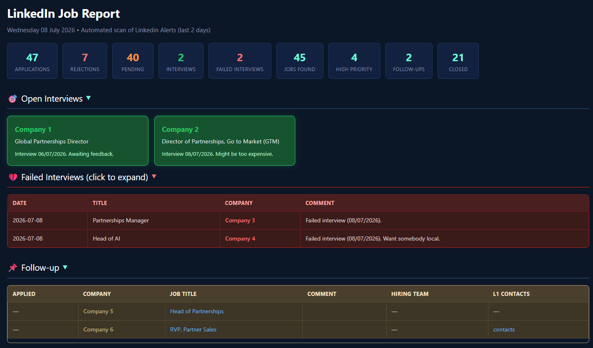
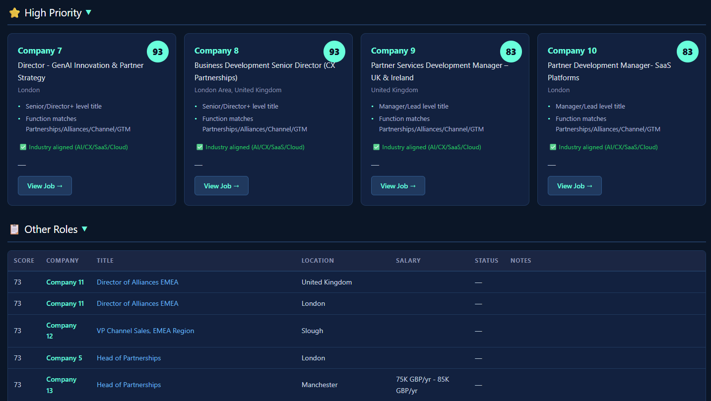
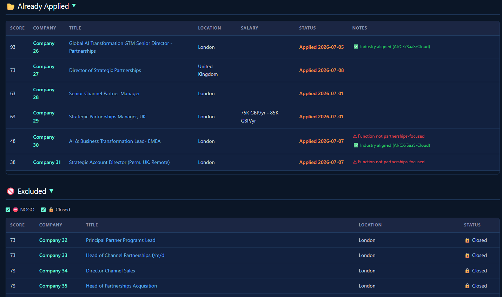

# LinkedIn Job Search Automation

## Why this project exists

Job hunting on LinkedIn is time-consuming. This project automates it: every morning, Claude reads your LinkedIn job alert emails, scores each role against your CV and target criteria, and produces a ranked HTML dashboard so you spend your time applying — not searching.

**Report overview** — header stats, collapsible Open Interviews / Failed Interviews / Follow-up sections:



**High Priority & Other Roles** — top-scoring roles as cards, the rest in a ranked table:



**Already Applied & Excluded** — tracked outcomes, with NOGO/Closed decluttering checkboxes:



---

## How it works

Claude Desktop (Cowork mode) runs the workflow daily. It reads your Gmail, visits each LinkedIn job page, scores roles, and saves a dated HTML report to this folder.

Ideally most people would love to search LinkedIn directly, however due to a lack of Open Interface, this is proving difficult. The workaround is to use LinkedIn job alerts. Having created several of these alerts set to daily frequency, I found that many roles appeared repeatedly across multiple alerts, some I had already applied to, and others were no longer accepting applications — resulting in a lot of time wasted checking the same jobs over and over again. This is now a thing of the past.

In order to overcome these challenges the automation looks at the LinkedIn Job alerts received in a set period (by default 1 day), creates a unique list of jobs (eliminating duplicates), scores the job against the CV profile, identifies those jobs already applied or rejected and displays relevant jobs in a prioritised list ready to apply.

Duplicates are identified by **company + job title + location**, not just company + title: the same role reposted under a new LinkedIn job ID (with the same location) is recognised as a repost and only scored once, while the same job title posted by the same company for two different locations (e.g. London and Manchester) is correctly treated as two separate roles and scored independently.

The report is organised into sections: 🎯 Open Interviews, 💔 Failed Interviews, 📌 Follow-up, ⭐ High Priority, 📋 Other Roles, 📂 Already Applied, and 🚫 Excluded. A role you've already applied to or heard back from moves out of High Priority/Other Roles into its own 📂 Already Applied section (sorted by score), so it doesn't clutter the roles you still need to act on, without losing visibility of it entirely. The one exception: a role you're actively following up on (`follow-up` status) that's also been applied to or rejected appears in **both** 📌 Follow-up and 📂 Already Applied — Follow-up is for tracking what you're chasing, Already Applied is for tracking outcomes, and a role can be both at once. If a follow-up role is later rejected and you don't reapply, it's automatically dropped from the Follow-up table (it's no longer "active").

Every section can be expanded or collapsed by clicking its header, and each section's default state (open or collapsed) is configurable per section — see `report_section_defaults` in `config.json` below. The 🚫 Excluded section additionally has two checkboxes ("⛔ NOGO" / "🔒 Closed") to temporarily hide those rows for a cleaner view — this is just a decluttering aid for the current viewing session (unticking one doesn't persist while you keep clicking around the same open report, and never changes the header counters). Whether each checkbox starts ticked or unticked on a freshly generated report is configurable via `excluded_filter_defaults` in `config.json` (both default to ticked).

In addition to highlighting job opportunities, the automation is two-way and allows you to provide contextual information such as:

- NOGO on specific roles
- building a shortlist of opportunities to follow-up
- tracking ongoing interviews and outcomes

The Managing job feedback section shows examples of instructions. These will update the report without having to re-run the automation entirely, and will of course be taken into account in subsequent runs.

---

## File reference

| File | Purpose |
|------|---------|
| `TASK_prompt.txt` | The master prompt Claude follows every run. Defines the full workflow: what to read, how to score, what to output. |
| `prompts/CV_master.txt` | Your CV in plain text. Used for cover letters and outreach drafts. Only used for scoring if `use_cv_for_scoring` is set to `true` in `config.json` (default: false). |
| `prompts/scoring_rubric.txt` | Weighted scoring criteria (0–100). Defines what makes a role a strong match (seniority, function, industry, location, company quality). |
| `prompts/job_extraction_instructions.txt` | Tells Claude what fields to extract from each LinkedIn alert email (title, company, location, salary, apply link, etc.). |
| `config.json` | Configuration file. Defines Gmail label names, lookback periods, and feature toggles. Edit this to adapt the project to your own Gmail setup. |
| `inputs/job_feedback.json` | Your manual overrides. Add entries here to mark roles as NOGO (`skip`), `closed`, `interview`, or `follow-up`. Claude reads this on every run. Entries are matched to report jobs by company + title (+ location when known — see `location` field, added to disambiguate the same company+title posted in different cities). Each entry is automatically enriched with: the LinkedIn job URL (`url`), hiring team details (`hiring_manager_name`, `hiring_manager_linkedin`), and 1st-degree LinkedIn contacts at the company (`L1_contacts_url`, `L1_contacts`). |
| `cache/applications_cache.json` | Auto-generated cache of application and rejection history, built from your Gmail `Jobs` label. Created automatically on the first run. On subsequent runs only new emails (since the last run) are scanned, making status checks fast regardless of how long your job search has been running. Entries are matched by company + title (+ location when stated in the email, falling back to company + title otherwise). Do not edit manually. |
| `cache/applications_archive.json` | Auto-generated archive of stale application entries (no activity for longer than `applications_archive_after_months` months). Archived entries are moved back to the live cache if a new rejection email arrives. Do not edit manually. |
| `cache/jobs_seen_cache.json` | Auto-generated cache of every LinkedIn job ID scored to date. Prevents re-scoring the same job on subsequent runs when it reappears in alert emails, and catches reposts under a brand-new job ID by matching on company + title + location — the score is copied across, never recomputed, for a genuine repost. Stores score, reasons, flags, and location per job ID. Do not edit manually. |
| `cache/jobs_page_cache.json` | Auto-generated cache of LinkedIn page visit results (open/closed, salary, applicant count) per job ID. Eliminates redundant Chrome visits: closed jobs are never re-checked; open jobs appearing in the current report are re-checked after `job_page_recheck_days` days (default: 7). Kept per job ID intentionally (not deduped by role) since open/closed status and salary are specific to each individual posting. Do not edit manually. |
| `css/report-style-template.css` | The CSS template used when generating HTML reports. Claude reads this on every run and applies its styles to the output. Do not edit unless you want to change the visual design of all future reports. |
| `reports/daily-job-report-YYYY-MM-DD.html` | The output — a dark-blue HTML dashboard with scored, ranked jobs, split into collapsible sections (Open Interviews, Failed Interviews, Follow-up, High Priority, Other Roles, Already Applied, Excluded — see "How it works" above). Open in any browser. The footer shows the run's start/finish time and duration. |
| `logs/run_log.json` | Auto-generated history of run start/finish timestamps and duration, one record appended per run. Informational only — never read back as an input to scoring or the report. Do not edit manually. |
| `skills/` | Master skill instructions. Claude reads these directly on every run — they are the authoritative source. Contains `check-job-status` (verifies applied/rejected/NOGO status for every job) and `read-all-alert-emails` (ensures all alert emails, including confirmation emails, are fully processed). |
| [`_sample_data/daily-job-report-2026-07-08-anonymised.html`](_sample_data/daily-job-report-2026-07-08-anonymised.html) | An anonymised example of a generated report, so you can see the dashboard's layout and sections before running your own. |

**⚠️ DO NOT FORGET**

1. Copy your CV in plain text in `prompts/CV_master.txt` (currently blank)
2. Review `prompts/scoring_rubric.txt` and adapt the scoring to your ideal job profile.
3. Update `config.json` with your own Gmail label names if they differ from the defaults.

---

## Prerequisites

Before starting, you will need:
- **Claude Desktop** with Cowork mode enabled. Visit [claude.ai](https://claude.ai) to get started. This automation has been tested and runs well on **Claude Sonnet 5** (`claude-sonnet-5`), which is recommended for its balance of capability and token efficiency.
- **Gmail connector** installed in Claude Desktop (Settings → Plugins).
- **Claude in Chrome extension** installed and connected.
- **LinkedIn job alerts** configured for your target roles, set to daily frequency.

---

## Setup to reuse this project

### 1. Gmail — email redirection
- In Gmail, create a label called **`Linkedin Alerts`** or create your own (see step 2).
- Set up LinkedIn job alerts for your target roles. Gmail will receive them; create a filter to auto-label them `Linkedin Alerts`.
  The following filters can be used to redirect to **`Linkedin Alerts`**.

  ```
  Matches: from:(jobalerts-noreply@linkedin.com)
  Do this: Skip Inbox, Apply label "Linkedin Alerts", Never send it to Spam
  ```

  ```
  Matches: from:(jobs-noreply@linkedin.com) subject:(New jobs similar to)
  Do this: Skip Inbox, Apply label "Linkedin Alerts", Never send it to Spam
  ```
- Also create a **`Jobs`** label (or create your own) for application and rejection emails. These are managed manually: each time you submit an application or receive a recruiter response, move that email into the `Jobs` label. This keeps you in control of verifying each application was processed before Claude flags it as applied. If you prefer automation, a filter can be used, but you will also have to take account that some companies may confirm applications directly:
  ```
  Matches: from:(jobs-noreply@linkedin.com) Your application was
  Do this: Skip Inbox, Apply label "Jobs", Never send it to Spam
  ```

Note: keeping Job Alerts and Job Applications in separate labels is intentional for performance. Over time you can accumulate thousands of alert emails, but the task only searches those received within the period defined by `alerts_lookback_days` (default: 2 days). Application and rejection history is managed via `cache/applications_cache.json`: on the first run, Claude scans back `application_lookback_days` days to build the cache; on every subsequent run it only processes new emails since the last run, so performance stays fast regardless of history length.

### 2. Configure `config.json`
Edit `config.json` to match your Gmail label names:

```json
{
  "gmail_job_alerts_label": "Linkedin Alerts",
  "gmail_job_applications_label": "Jobs",
  "alerts_lookback_days": 2,
  "application_lookback_days": 120,
  "use_cv_for_scoring": false,
  "job_page_recheck_days": 7,
  "applications_archive_after_months": 4,
  "report_section_defaults": {
    "open_interviews": "open",
    "follow_up": "open",
    "failed_interviews": "collapsed",
    "high_priority": "open",
    "other_roles": "open",
    "already_applied": "open",
    "excluded": "open"
  },
  "excluded_filter_defaults": {
    "nogo": true,
    "closed": true
  }
}
```

- **`gmail_job_alerts_label`** — the Gmail label where LinkedIn job alert emails are stored
- **`gmail_job_applications_label`** — the Gmail label where application and rejection emails are stored
- **`alerts_lookback_days`** — how many days of alert emails to scan (default: 2). Using 2 ensures the full previous day is always captured regardless of what time the task runs. Increase further if you missed a day and want to catch up.
- **`application_lookback_days`** — how many days back Claude searches for past applications (default: 120)
- **`use_cv_for_scoring`** — if `true`, Claude includes your CV when scoring each role; if `false` (default), scoring uses the rubric only. The CV is always available for cover letters and outreach regardless of this setting.
- **`job_page_recheck_days`** — how many days before re-visiting an open job's LinkedIn page to refresh salary, applicant count, and open/closed status (default: 7). Only jobs appearing in the current report are re-checked; jobs that scored too low to appear are ignored.
- **`applications_archive_after_months`** — how many months of inactivity before an application/rejection entry is moved from `cache/applications_cache.json` to `cache/applications_archive.json` (default: 4). Archiving runs once per calendar month and keeps the live cache lean without losing history — archived entries still count toward the report's header totals and are restored automatically if a rejection email arrives for them later.
- **`report_section_defaults`** — controls whether each report section starts expanded (`"open"`) or collapsed (`"collapsed"`) when the HTML report is opened. Every section is independently configurable (`open_interviews`, `follow_up`, `failed_interviews`, `high_priority`, `other_roles`, `already_applied`, `excluded`); only `failed_interviews` defaults to `"collapsed"` out of the box. To change a section's default, just tell Claude in chat (e.g. *"collapse Other Roles by default from now on"*) — it will update this block for you. If this key is missing entirely (e.g. an older `config.json`), Claude falls back to the same defaults shown above.
- **`excluded_filter_defaults`** — controls whether the 🚫 Excluded section's "⛔ NOGO" and "🔒 Closed" checkboxes start ticked (`true`) or unticked (`false`) each time a fresh report is generated. Both default to `true`. To change one, tell Claude in chat (e.g. *"default the NOGO checkbox to unticked from now on"*). If this key is missing, Claude falls back to both `true`.

If you use different label names in Gmail, update these values here. Claude reads this file on every run and uses these values throughout.

### 3. Connect Gmail to Claude
- In Claude Desktop, install the Gmail connector (Settings → Plugins).
- Grant access to your Gmail account.

### 4. Install the custom skills
- This project includes two custom skills in the `skills/` folder.
- In Claude Desktop, go to Customize → Skills and install both `check-job-status` and `read-all-alert-emails`. This only needs to be done once to enable the skills in Claude Desktop.
- From that point on, Claude reads the skill instructions directly from the local `skills/` folder on every run — the local files are the master. Any future skill updates are made to the local files only; no further action in Customize → Skills is needed.

### 5. Connect Chrome to Claude
- Install the Claude in Chrome extension.
- Claude uses it to visit each LinkedIn job page and check if roles are still open and whether a salary is listed.

### 6. Update your CV
- Open your CV in Word, select all, paste into Notepad (or any plain text editor), and save as `prompts/CV_master.txt`. No special formatting needed — plain text is sufficient.

### 7. Update the scoring rubric
Review `prompts/scoring_rubric.txt` and adapt the scoring to your ideal job profile. This is important so that the dashboard can prioritise job opportunities based on the criteria that matter to you: role type, industry, experience, location, and company characteristics. Feel free to add or remove scoring categories based on your requirements.

### 8. Set this folder as your Cowork project folder
- In Claude Desktop, open this folder as your project.
- Claude will read `TASK_prompt.txt` automatically at the start of each session.

### 9. Run it
- Open Claude Desktop and say: **"Run the daily job report"**.
- Claude will scan LinkedIn alert emails for the number of days defined in `alerts_lookback_days` (default: 2 days), score all roles, visit each LinkedIn page, and save a dated HTML report in this folder.

### 10. Schedule it (recommended)
The real value of this project is waking up to a ready-made job list every morning. Once your first report runs successfully, automate it by asking Claude: *"Run the daily job report every morning at 8am"*, or use the scheduling feature built into Cowork.

---

## Managing job feedback

As you interact with job opportunities — applying, interviewing, or deciding to pass — it's important to keep the automation informed. This serves two purposes: first, it keeps the daily report accurate and actionable (no point seeing roles you've already rejected or applied to); second, it builds a persistent memory across runs, so Claude can correctly flag statuses even as new alert emails arrive days later.

You don't edit `inputs/job_feedback.json` directly — just tell Claude in plain English and it updates the file and regenerates the report automatically.

**Examples:**

- `"Channel Manager @ Acme: NOGO, the role is too junior"` → flags as ⛔ NOGO
- `"Head of Partnerships @ Acme: applied"` → adds to follow-up tracking
- `"Head of Partnerships @ Acme: interview"` → moves to Open Interviews section
- `"Head of Partnerships @ Acme: failed interview"` → removes from interview list

If the same company posts the same job title in more than one location, mention the location in your command (e.g. `"Head of Partnerships @ Acme (Manchester): NOGO"`) so Claude flags only that specific posting and not an identically-titled role at a different location.

Supported statuses Claude understands:

- ⛔ **NOGO** — role stays visible in the Excluded section but is not actionable
- 🔒 **Closed** — moved to the Excluded section
- 📌 **Follow-up** — tracked in the Follow-up table with application date; if it's also been applied to or rejected, it additionally appears in Already Applied (see "How it works" above); if later rejected with no reapplication, it's automatically removed from Follow-up
- 🎯 **Interview** — shown at the top of the report in Open Interviews
- 💔 **Failed Interview** — shown in the collapsible Failed Interviews section, sorted most recent first
- 🟠 **Applied** / 🔴 **Rejected** (no override) — moved out of High Priority/Other Roles into the 📂 Already Applied section, regardless of score

### Automatic enrichment

Every time a new entry is added to `inputs/job_feedback.json`, Claude automatically enriches it with additional context at no extra effort from you:

**LinkedIn job URL** — Claude searches LinkedIn using the company name and job title, extracts the job ID, and stores the URL in the `url` field. The Job Title in the Follow-up table links directly to the listing. If the listing cannot be found, the field is left blank.

**1st-degree contacts (L1 Contacts)** — Claude finds your LinkedIn 1st-degree connections who currently work at the company and stores them in `L1_contacts`. In the Follow-up tracker, if there are 3 or fewer contacts their names are displayed as clickable profile links; if there are 4 or more, a single "N contacts" link is shown. If no connections are found, the field is left blank.

**Hiring Team** — When you provide a hiring manager's LinkedIn profile URL (e.g. from the "Meet the hiring team" section on the job page), Claude resolves their full name from their profile and stores both in `hiring_manager_name` and `hiring_manager_linkedin`. The Hiring Team column in the Follow-up table shows their name as a clickable link. You can provide this in your feedback command: e.g. `"Acme: hiring manager is https://linkedin.com/in/janedoe/"`.

### Follow-up tracker columns

The Follow-up table in the report shows 6 columns:

| Column | Source |
|---|---|
| Applied | Date extracted from the comment field |
| Company | Company name |
| Job Title | Job title, linked to the LinkedIn listing |
| Comment | Any additional notes (application date excluded) |
| Hiring Team | Name linked to LinkedIn profile (from `hiring_manager_linkedin`) |
| L1 Contacts | 1st-degree connections at the company |

---

## Troubleshooting

**No jobs appearing in the report** — Check that your LinkedIn alerts are set to daily frequency and that at least one alert email has arrived in Gmail under the label defined in `gmail_job_alerts_label` in `config.json`, in the last 24h.

**Chrome extension errors** — Make sure the Claude in Chrome extension is installed and the browser is open when running the report. Claude needs an active browser to visit LinkedIn job pages.

**Wrong label name** — The Gmail label names in `config.json` must exactly match what you created in Gmail (case-sensitive). If Claude finds no emails, open `config.json` and verify `gmail_job_alerts_label` and `gmail_job_applications_label` match your Gmail labels precisely.

**Same job title appears twice in the report** — This is expected if the same company has posted that title for two different locations (e.g. London and Manchester) — they're scored and shown as separate roles. If they're genuinely the same posting appearing twice, check that their location text matches exactly (or normalises to the same place); if not, this is a role that needs a NOGO/feedback entry scoped to the correct location — see "Managing job feedback" above.

---

## ⚠️ Important — Re-sharing this project

If you pass this project on to someone else, remove all personal data before distributing to avoid inadvertently sharing private information:

- Blank `CV_master.txt`
- Empty `inputs/job_feedback.json` (replace contents with `[]`)
- Delete all files in the `reports/` folder
- Delete all files in the `cache/` folder
- Delete `logs/run_log.json` (or empty it to `[]`) — it's just run-history timestamps, but it's specific to your usage
- Keep the `skills/`, `css/`, `inputs/`, and `prompts/` folders — they contain no personal data and must be included for the project to work (re-blank `prompts/CV_master.txt` before sharing)
